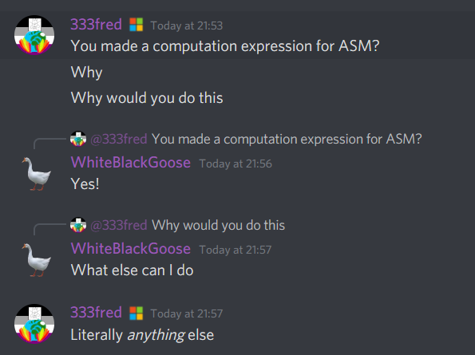
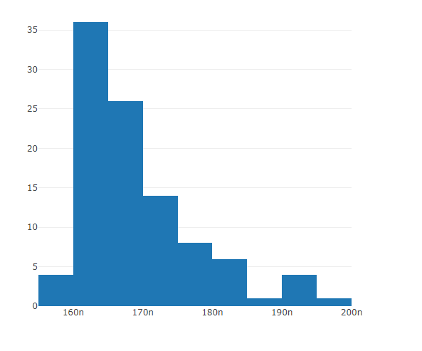

# Asm To Delegate

Compile asm code into C# functions on fly! For now supports only x86 Windows 64-bit.

## Get started

Get the lib (it's probably distributed by nuget) and it's recommended to write these usings:
```cs
using Iced.Intel;
using static Iced.Intel.AssemblerRegisters;
using AsmToDelegate;
```

## Examples

### Add two integers
Adds two integers:
```cs
var asm = new Assembler(bitness: 64);
asm.mov(rax, rcx);
asm.add(rax, rdx);
asm.ret();
var add = asm.ToFunctionPointerWinX64<ulong, ulong, ulong>();
Assert.Equal(44ul, add(31, 13));
```

### Something complex
Finds `a * b + c * d`:
```cs
var asm = new Assembler(bitness: 64);

var a = rcx;
var b = rdx;
var c = r8;
var d = r9;

asm.mov(rax, a);
asm.imul(rax, b);
asm.mov(rbx, c);
asm.imul(rbx, d);
asm.add(rax, rbx);
asm.ret();
var add = asm.ToFunctionPointerWinX64<long, long, long, long, long>();
Assert.Equal(210L, add(5, 2, 10, 20));
```

... assuming the [conventions](https://docs.microsoft.com/en-us/cpp/build/x64-calling-convention?view=msvc-160).

### Compute TSC
Returns [**Time Stamp Counter**](https://en.wikipedia.org/wiki/Time_Stamp_Counter):
```cs
var asm = new Assembler(bitness: 64);
asm.rdtsc();
asm.shl(rdx, 32);
asm.add(rax, rdx);
asm.ret();
var tsc = asm.ToFunctionPointerWinX64<ulong>();
Console.WriteLine($"{tsc()} cycles since last reset");
```

### What about F#?

F# has *computation expressions* which allow for an absolutely mind-blowing syntax.

Here's the same function which computes the number of cycles.
```fs
open AsmToDelegate.FSharp

let getCycles = asm {
    rdtsc
    shl rdx 32uy
    add rax rdx
    ret
}

printfn $"{getCycles ()}"
```

Feedback from [Fred](https://github.com/333fred):


## NaiveNanoBench

I was inspired by [nanoBench](https://github.com/andreas-abel/nanoBench), advanced linux tool for measuring
costs of different instructions. So I made a *very* naive version of it for C#.

Here's an example. We measure the time taken by `mov rcx, 6` instruction.

```cs
using Iced.Intel;
using static Iced.Intel.AssemblerRegisters;
using AsmToDelegate;
using NaiveNanoBench;

var movFunction = new Assembler(bitness: 64);
for (int i = 0; i < 1000; i++)
{
    movFunction.mov(rcx, 6);
}
movFunction.ret();

var compiled = movFunction.ToUnmanagedFunctionWinX64<ulong, ulong>();

var bench = new NanoBench(userInvokationsPerCall: 1000);

bench.Bench(compiled.Delegate);
bench.ShowDistributionOfResults();
```

It will warm up the thing until it more or less understands what time it takes to run the delegate,
then it will switch to the actual measurement phase, perform 100 measurements where each of them 
takes approximately 1 second, and return the mean and the distribution. It all depends on a *lot*
of factors, so I will just show the result (you can bench your own), as it's an example for the lib,
not real answer to "how much time it takes to run a single `mov`".

```
mean: 175 ns.
```


